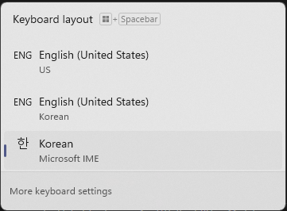

# korstick

윈도우의 입력기를 강제로 한국어 IME로 전환시키는 프로그램.

## 필요성

윈도우에서 한국어와 영어를 입력하려면 가장 간단한 방법은 한/영 전환키를 사용하여 한국어 IME에서 입력 수단을 변경할 수 있습니다.

하지만 윈도우에서 영어 언어 팩을 설치하게 될 경우, 추가적으로 2개의 영어와 한국어 레이아웃이 다음과 같이 추가되죠:

그리고 더욱 더 친절하게도, 윈도우는 때때로 랜덤하게 셋 중 하나를 골라 입력기를 변경해버리는데, 한/영 전환키가 작동을 멈추고 윈도우키+스페이스 단축키로 다서 IME를 변경하기 전까지 알아차리지 못할 수도 있죠.

korstick은 이를 방지하기 위해 사용자 대신 현재 활성화된 IME를 계속해서 한국어 IME로 변경해줍니다.

## 설치법

`cargo build --release`를 사용하여 직접 컴파일하시거나, GitHub Releases에서 이미 컴파일된 실행파일을 받으실 수 있습니다. (편의성을 위해, [가장 최신 버전은 여기에서 받으실 수 있습니다][latest-exe].)

[latest-exe]: https://github.com/ericswpark/korstick/releases/latest/download/korstick.exe

프로그램을 아무데나 저장하신 후, 실행하세요. 실행 중에는 트레이 메뉴 아이콘이 새로 나오는데, 이를 사용하여 프로그램을 종료시킬 수 있습니다.

만약 부팅 시 자동으로 실행되게 하고 싶으시면, 실행창을 열으셔서 (윈도우키+R), `shell:startup`을 입력하신 다음, 나타나는 창에 바로가기를 추가하시면 됩니다.

## FAQ

### 왜 사용하지 않는 키보드 레이아웃은 삭제할 수 없나요?

마소한테 물어보세요!

무슨 이유에선지, 각 언어 팩당 최소한 한 개의 키보드 레이아웃이 활성화되도록 만들어놨습니다. 윈도우 11 전에는 우회방안이 있었는데, 윈도우 11부터 전부 다 패치되어 없어졌죠.

만약 윈도우 표시 언어를 영어로 설정하면서 한국어와 영어 입력을 쉽게 하고 싶으실 경우 이 방법이 제가 만든 최적의 우회방안입니다.

### 왜 윈도우 서비스로 실행하지 않죠? 왜 트레이 메뉴 아이콘을 보여야 되죠?

윈도우 서비스들은 `PostMessage`나 사용자 세션에 접근하는 다른 윈도우 API 함수들을 실행할 수 없기에 그렇습니다. 윈도우 Vista부터 생긴 제약인데, 우회방안은 몇 가지가 있지만 마이크로소프트에서 사용을 권장하지 않기에 이렇게 만들었습니다.

### 프로그램이 동작하지 않습니다. / 디버그 출력을 보고 싶습니다.

`src/main.rs` 파일 상단에 있는 `#![windows_subsystem = "windows"]` 줄을 삭제한 후 다시 재컴파일하세요.
