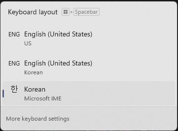

# korstick

A program to continuously and forcibly set the Windows IME to the Korean IME.

## Why?

If you'd like to type both Korean and English, the simplest solution is to use the "Hangul" key (or 한/영 key) to switch between Korean and English on the Korean IME.

However, on Windows, installing and activating the English language pack results in two additional English and Korean keyboard layouts, like this:

And even more helpfully, Windows likes to randomly switch between all three, and you'll only figure it out when your Hangul key stops working and you have to switch IMEs again using the Windows+Space shortcut.

This program continuously sets the currently active IME to the Korean IME so you don't have to do that.

## Installation

You can build the program yourself using `cargo build --release`, or grab a prebuilt from GitHub Releases.

Place the program wherever you'd like, then launch it. A tray menu icon will show, which you can use to quit the program.

To have this program run at startup, open the Run dialog (Windows+R), type `shell:startup`, and add a shortcut to the program in there.

## FAQ

### Why not a Windows service? Why another tray icon?

Unfortunately, you cannot use `PostMessage` or any other Windows API functions that interact with the user session as a Windows service, starting from Windows Vista. There are workarounds, but Microsoft does not recommend using them.

### The program doesn't work for me. / I'd like to see the debug output.

Recompile with the `#![windows_subsystem = "windows"]` line at the top of `src/main.rs` removed.
